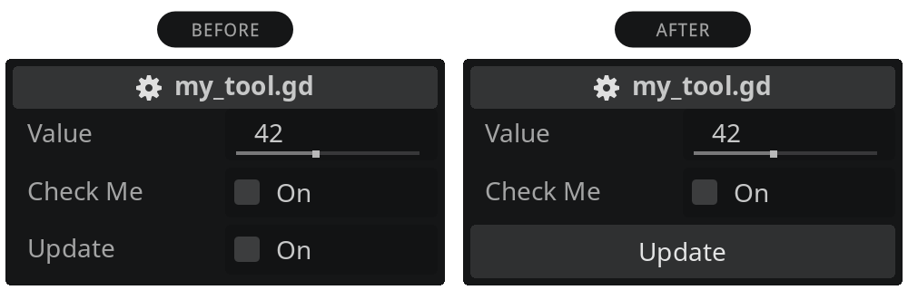
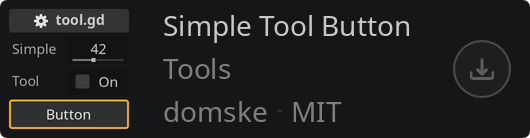
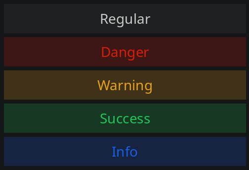
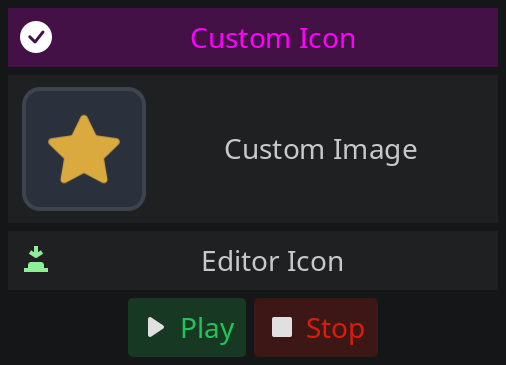
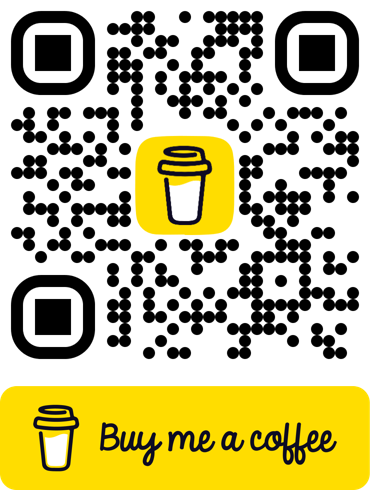

# Godot Addon - Simple Tool Button

A lightweight Godot addon that turns your bool button-like checkboxes into real buttons. Just in place. Without changing the code logic or having dependencies. It's easier than you might think.



## Getting started

Just download the addon and enable it in your project settings. Prefix your bool exports with `btn_` and enjoy your buttons. Reload the scene (Scene > Reload Saved Scene) if you see no buttons.

<a href="https://godotengine.org/asset-library/asset/3313" target="_blank"></a>

## Example

```gdscript
@export var btn_update: bool:
  set(v): update()

func update():
  print("Button pressed")
```

This replaces the checkbox by a button.

## Now in Color!



There are four colors available that you can use as the second word.

- `danger` (red)
- `warning` (yellow)
- `success` (green)
- `info` (blue)

```gdscript
@export var btn_danger_delete: bool:
  set(v): delete_all()
```

## Advanced buttons

With advanced buttons you can use icons (build-in or custom), having multiple buttons in row and more. See examples:



```gdscript
@export var btn_advanced: Array:
  get: return [{
    "icon": "res://icons/check.svg",
    "color": "#FF00FF",
    "text": "Custom Icon",
    "click": func(): update(),
  }]

@export var btn_custom_image: Array:
  get: return [{
    "icon": "res://icons/image.png",
    "click": func(): update(),
  }]

@export var btn_editor_icon: Array:
  get: return [{
    "icon": "Button",
    "fill": true,
    "click": func(): update(),
  }]

@export var btn_mutiple_buttons: Array:
  get: return [
    {
      "text": "Play",
      "icon": "Play",
      "click": func(): update(),
    },
    {
      "text": "Stop",
      "icon": "Stop",
      "click": func(): update(),
    }
  ]
```

| Property | Description                                                                 |
| -------- | --------------------------------------------------------------------------- |
| click    | Function to call.                                                           |
| icon     | Icon name of EditorIcons (see below) or path to your image (svg, png, etc). |
| color    | Color name (see above) or custom hex string or Color object.                |
| text     | Text for the button. Uses the variable name if not set.                     |
| fill     | The button will use the full available width.                               |

All properties are optional. But a button without "click" makes no sense.

Since the you export an Array, you can use multiple buttons in row. You can also only return a Dictionary.

> For EditorIcons see https://github.com/godotengine/godot/tree/master/editor/icons (it should also be visible in autocomplete panel)

> Note: Changes within exported Array/Dictionary will not update until you change the variable name. You could rename, save and revert again. A workaround is using getter only. So that the editor value does not persist. Because the value is stored in scene (tscn).

> Note: The advanced buttons require this addon and is currently experimental. The bool buttons work without this addon.

## FAQ

### Why isn't this working?

Try one of the following:

- Reload the scene: Scene > Reload Saved Scene.
- If you are using advanced buttons, try renaming the exported variable or use getter only.
- Re-enable the addon: Project > Project Settings... > Plugins.
- Restart Godot.

### What's the trick?

In Godot you can export a bool variable, which will appear as a checkbox in the inspector. Then define a setter that ignores the value and only calls a function. Since a checkbox is confusing when expecting a button, I developed this addon to replace it with a real button. It detects buttons by the variable name prefix, which still allows regular checkboxes.

### Why is the bool export still used and not another custom solution?

Because this is currently the way to implement button-like behavior in Godot inspector. If this addon is not present, you can still use it as a fallback like before. No changes needed. It simply replaces the checkbox with the button appearance.

### Can I change the color or show an icon?

Yes, you can change the color and icon. See examples above. Icons are only possible for advanced buttons (which requires this addon).

### Why use get for advanced buttons?

This prevents the editor from storing values ​​persistently. Otherwise, you will have to rename the variable name when you change a value. Currently, the best solution is to use `get`.

## Support

If you like my work, I would greatly appreciate your support!

<a href="https://www.buymeacoffee.com/domske" target="_blank"></a>
