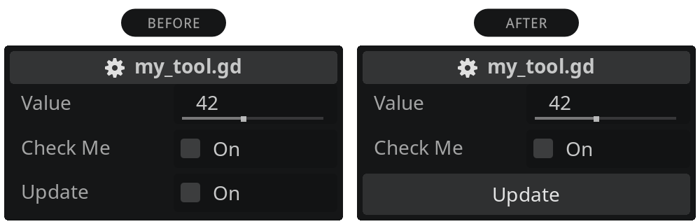

# Godot Addon - Simple Tool Button

A lightweight Godot addon that turns your bool button-like checkboxes into real buttons. Just in place. Without changing the code logic or having dependencies. It's easier than you might think.



## Getting started

Just download the addon and enable it in your project settings. Prefix your bool exports with `btn_` and enjoy your buttons. Reload the scene (Scene > Reload Saved Scene) if you see no buttons.

## Example

```gdscript
@export var btn_update: bool:
  set(v): update()

func update():
  print("Button pressed")
```

This replaces the checkbox by a button.

## FAQ

### Why isn't this working?

Oh, I hope Godot didn't change anything. Try one of the following:

- Reload the scene: Scene > Reload Saved Scene.
- Re-enable the addon: Project > Project Settings... > Plugins.
- Restart Godot.

### What's the trick?

In Godot you can export a bool variable, which will appear as a checkbox in the inspector. Then define a setter that ignores the value and only calls a function. Since a checkbox is confusing when expecting a button, I developed this addon to replace it with a real button. It detects buttons by the variable name prefix, which still allows regular checkboxes.

### Why is the bool export still used and not another custom solution?

Because this is currently the way to implement button-like behavior in Godot inspector. If this addon is not present, you can still use it as a fallback like before. No changes needed. It simply replaces the checkbox with the button appearance.

### Can I change the color or show an icon?

This addon just replaces the bool fake button with a real button. There is currently no option for color or icon for compatibility reasons. But I already have some ideas for implementation.

## Support

If you like my work, I would greatly appreciate your support!

<a href="https://www.buymeacoffee.com/domske" target="_blank"></a>
